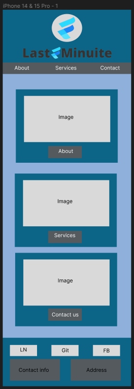
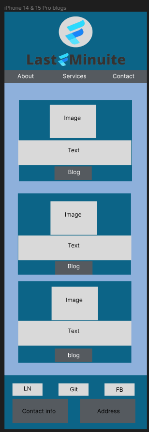
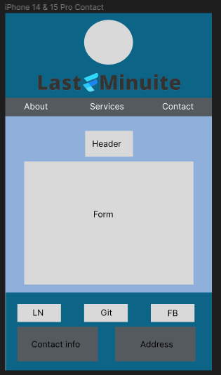
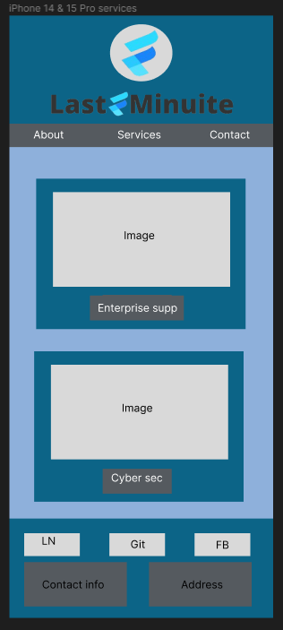
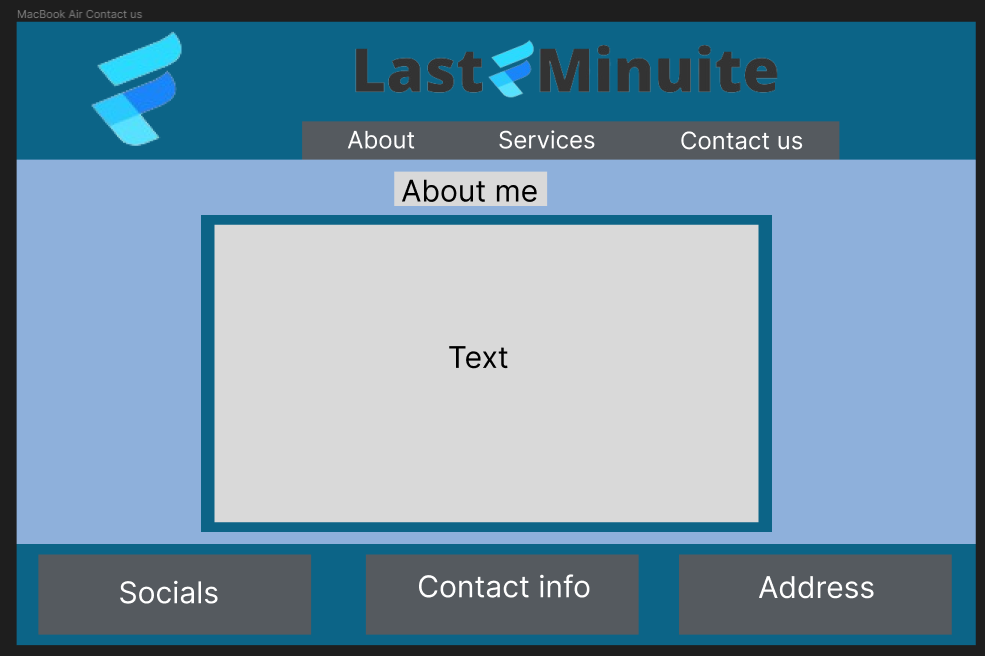
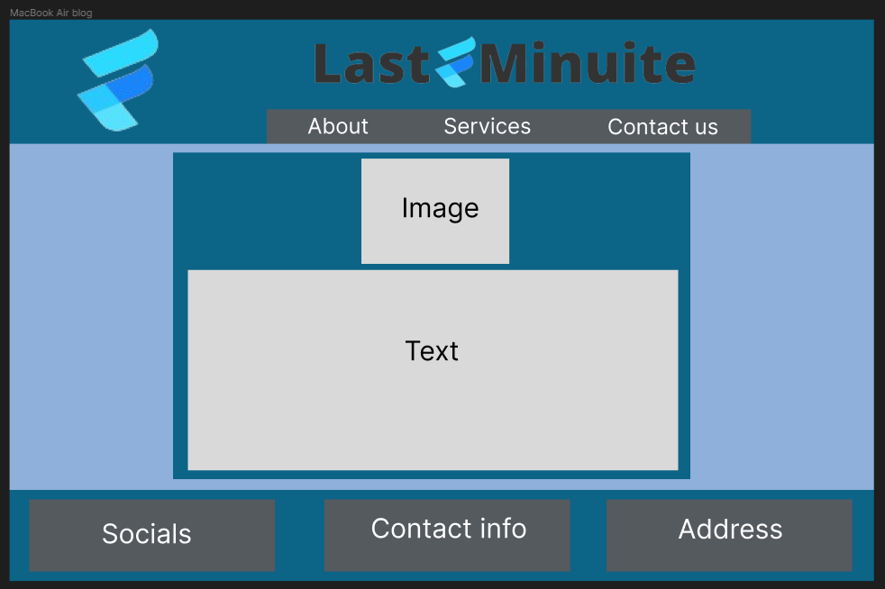
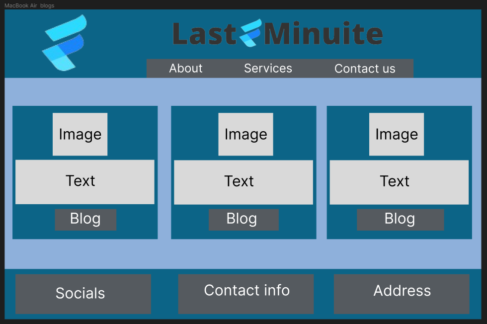
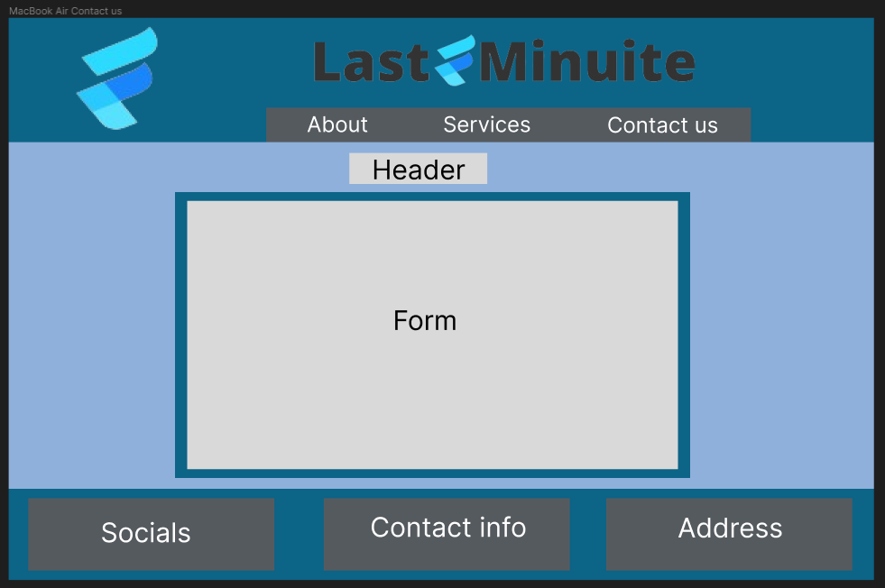
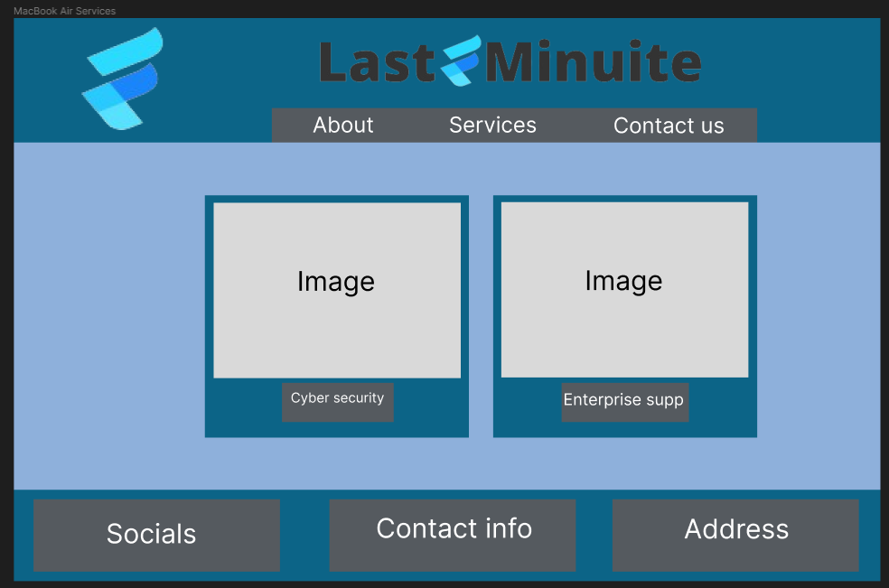

## Last Minuite IT services website

- html
    - Home page
    - About page
    - Contact us page
    - Services page

- CSS
    - Inded css page for whole site
    - Unique styling for each html page where appropriate 
    - Create styling for mobile, tablet and desktop

- Create Github repo
- Project management with Trello
- Site map
- Wireframe design 

## Deployment link

https://main--lastminuiteit.netlify.app/

## Description of website

- purpose of website

The purpose of this website is to showcase the persons web design skills and to provide the relevalt listed services to anyone who goes to the page.

- Functionality and features

The website uses a range or HTML and CSS features to bring everyting together. Some of them are media queries, to re arrange the style of the pages according to different device sizes. Flex box and grid to align items of pages. 

- Target audience

The target audience of this website is any small-medium size company that needs help with any of the services (Cyber security and enterprise support) listed. 

- tech stack

The website is written in HTML and styled with CSS. It is deployed on Netlify.

## Trello board

## Site map

## Mobile phone design

## Desktop design

## References
About us icon: https://www.flaticon.com/free-icon/about-us_15659